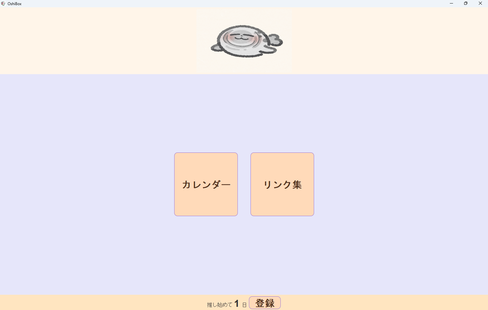
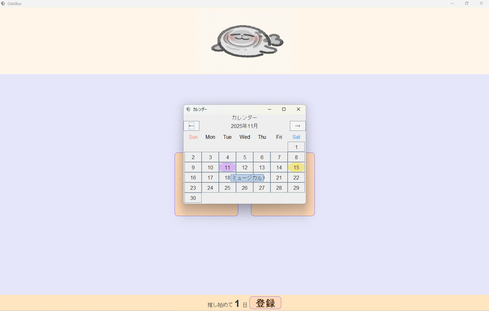
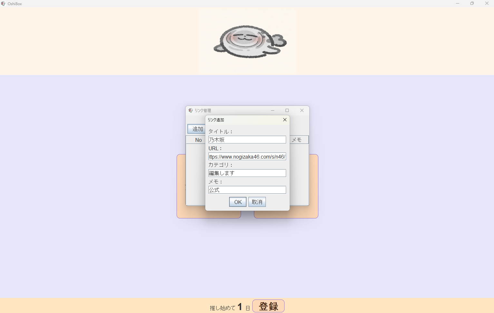
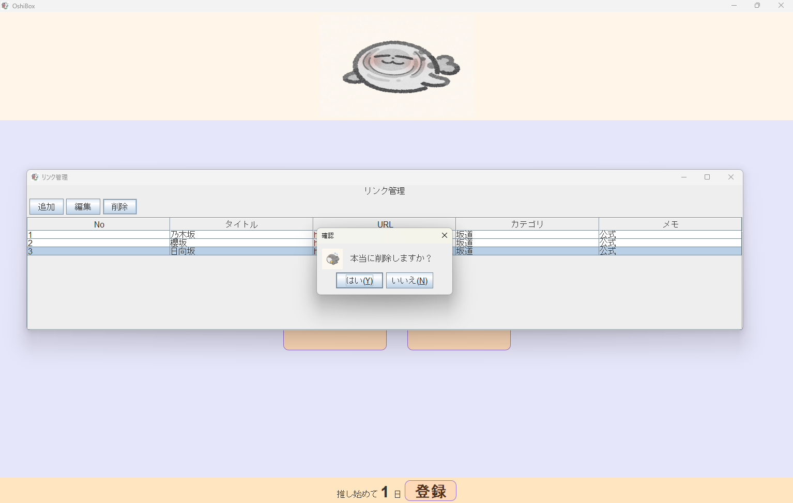

# JavaSwingApp
AIとテキストの力を借りて初めて作ったアプリケーションです

## アプリ概要
- JavaSwingで作った簡単なデスクトップアプリ
- カウントアップ、スケジュール表示、リンク管理機能

## 使用技術、素材
- Java
- Swing
- フリーペンシル(https://iconbu.com/)

## 機能説明
- メイン画面：アプリの各機能へのナビゲーション
- カウントアップ：任意の日付を入力して数字をカウントアップ
- スケジュール：カレンダーを表示、簡単なメモ登録も可能
- リンク管理：webリンクの登録・編集・削除

## 苦労したところ
- 介護の合間に学習時間を確保する必要がありました
- 意図とはずれたコードを提案されることがあり、AIへの質問の仕方も重要だと感じました
- 初めてJavaに触れたこともあり、コードの一つ一つを調べながら実装を進めたため、完成までかなり時間がかかりました
- JPanelのレイアウト(NORTHやWESTなどの配置)に苦労しました
  - ボタンやラベルが思った位置に配置できず、見た目を整えるのに時間がかかりました
- カレンダーやリンク機能の追加・編集・削除機能で、画面表示が正しく更新されず悩みました

> 理解度がまだ低くコードの写経にならざるを得ないところがありましたが、コピペに頼らずすべて手打ちで打ち込むことでJavaに慣れていきました。
> 解説コメントを付けたり自分なりにデザインや構図を調整したりしながら実装を進めています。
> 現場ではJavaFXの方が多く使用されているようですが、慣れるために(比較すると)学習コストが低いSwingにて挑戦しました。

## 今後の予定
- 家計簿やグッズ管理などの新機能実装やDB接続へ挑戦したいです

## スクリーンショット

メイン画面  

カウントアップ機能  

カレンダー機能  

  

リンク管理画面  
  
  
  
  
  
  

